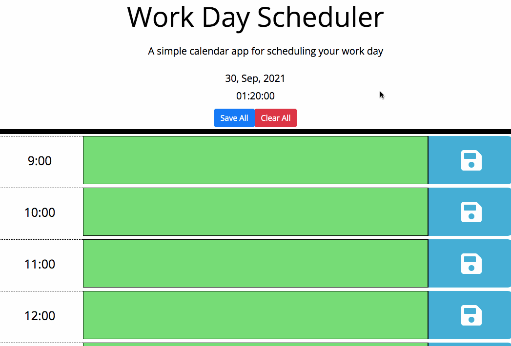

# dayPlanner **([Link](https://mstephen19.github.io/dayPlanner/))**

This is a web-app that allows a user to track and note down daily tasks. The text boxes will be displayed as grey when the corresponding time is in the past, as red when it is in the present, and as green when it is in the future. The user can save their tasks and reload the page to see them still there. There are "Save All" and a "Clear All" buttons for convenience and ease of use.



## Built With

* [HTML](https://developer.mozilla.org/en-US/docs/Web/HTML)
* [CSS](https://developer.mozilla.org/en-US/docs/Web/CSS)
* [Javascript](https://developer.mozilla.org/en-US/docs/Web/JavaScript)
* [Bootstrap](https://getbootstrap.com)
* [MomentJS](https://momentjs.com/)
* [jQuery](https://jquery.com/)
* [Google Fonts](https://fonts.google.com/)

## Notable Stuff

### Javascript logic used to load user inputs as an array of objects from localStorage:

``` Javascript
  $(function loadTasks(){
    var pulledData = JSON.parse(localStorage.getItem('userTasks'));
    for (let i = 0; i < pulledData.length; i++){
      allRows[i].childNodes[3].innerHTML = pulledData[i].text;
    }
  });
```

### Javascript logic used to change colors of textareas based on time using .diff in MomentJS:

``` Javascript
  $(function changeDivColor() {
    for (let i = 0; i < hourBoxes.length; i++) {
      let getValue = hourBoxes[i].textContent;
      let changeToMmt = moment(getValue, 'HH[:]mm');
      let theBox = hourBoxes[i];
      let textArea = theBox.nextElementSibling;
      if (changeToMmt.diff(today, 'minutes') < 0) {
        textArea.classList.add('past');
      } else if (changeToMmt.diff(today, 'hours') > 0) {
        textArea.classList.add('future');
      } else {
        textArea.classList.add('present');
      }
    }
  });
```

## Deployed Link

* [Live Site Here](https://mstephen19.github.io)

## Author

**Matt Stephens** 

- [Link to Portfolio Site](https://mstephen19.github.io)
- [Link to Github](https://github.com/mstephen19)
- [Link to LinkedIn](https://www.linkedin.com/mstephen19)

### Acknowledgments

* Shoutout to The Docs. Read the docs!
* Hat tip to console logging.